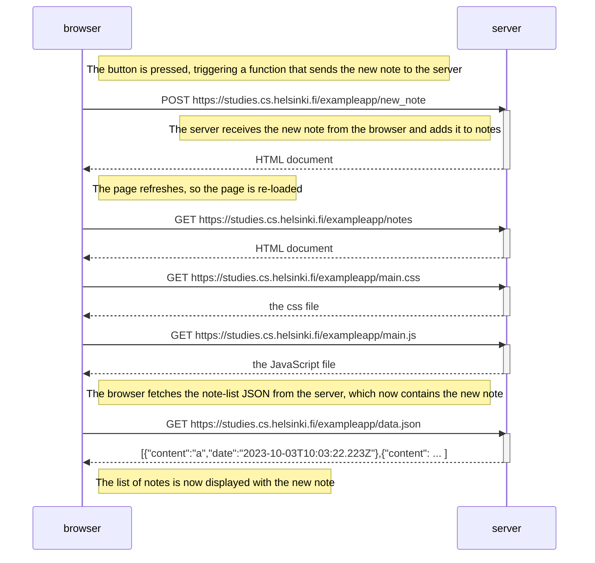

```mermaid
sequenceDiagram
    participant browser
    participant server
    

    Note right of browser: The button is pressed, triggering a function that sends the new note to the server

    browser->>server: POST https://studies.cs.helsinki.fi/exampleapp/new_note
    activate server
    Note left of server: The server receives the new note from the browser and adds it to notes
    server-->>browser: HTML document
    deactivate server

    Note right of browser: The page refreshes, so the page is re-loaded

    browser->>server: GET https://studies.cs.helsinki.fi/exampleapp/notes
    activate server
    server-->>browser: HTML document
    deactivate server
    
    browser->>server: GET https://studies.cs.helsinki.fi/exampleapp/main.css
    activate server
    server-->>browser: the css file
    deactivate server
    
    browser->>server: GET https://studies.cs.helsinki.fi/exampleapp/main.js
    activate server
    server-->>browser: the JavaScript file
    deactivate server
    
    Note right of browser: The browser fetches the note-list JSON from the server, which now contains the new note
    
    browser->>server: GET https://studies.cs.helsinki.fi/exampleapp/data.json
    activate server
    server-->>browser: [{"content":"a","date":"2023-10-03T10:03:22.223Z"},{"content": ... ]
    deactivate server    

    Note right of browser: The list of notes is now displayed with the new note
```