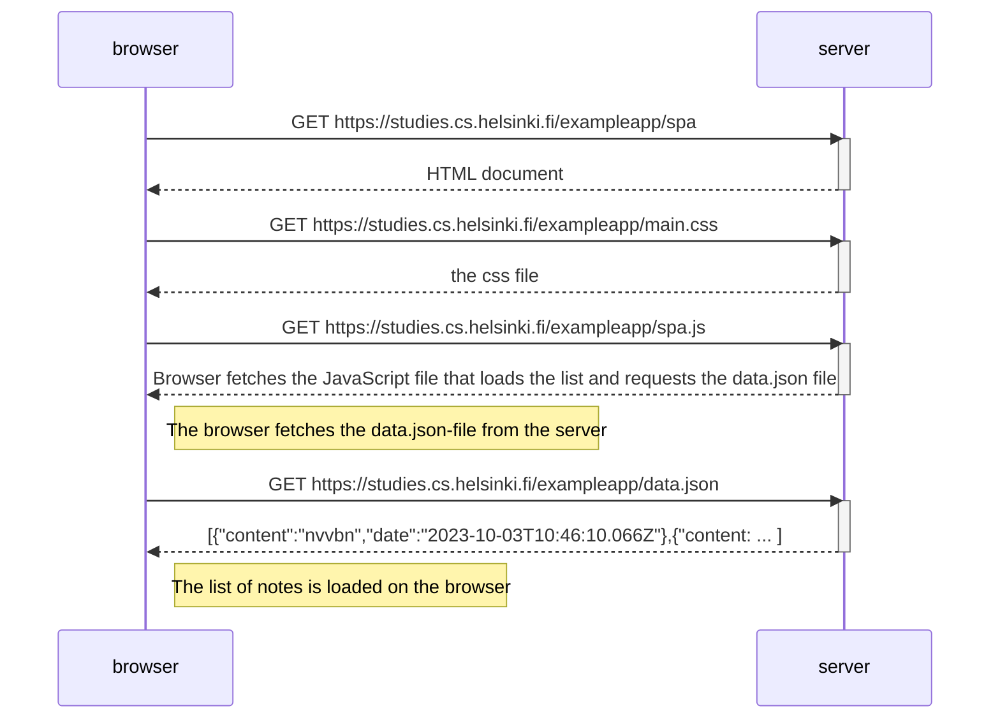

```mermaid
sequenceDiagram
    participant browser
    participant server


    browser->>server: GET https://studies.cs.helsinki.fi/exampleapp/spa
    activate server
    server-->>browser: HTML document
    deactivate server
    
    browser->>server: GET https://studies.cs.helsinki.fi/exampleapp/main.css
    activate server
    server-->>browser: the css file
    deactivate server
    
    browser->>server: GET https://studies.cs.helsinki.fi/exampleapp/spa.js
    activate server
    server-->>browser: Browser fetches the JavaScript file that loads the list and requests the data.json file
    deactivate server
    
    Note right of browser: The browser fetches the data.json-file from the server
    
    browser->>server: GET https://studies.cs.helsinki.fi/exampleapp/data.json
    activate server
    server-->>browser: [{"content":"nvvbn","date":"2023-10-03T10:46:10.066Z"},{"content: ... ]
    deactivate server    

    Note right of browser: The list of notes is loaded on the browser
```