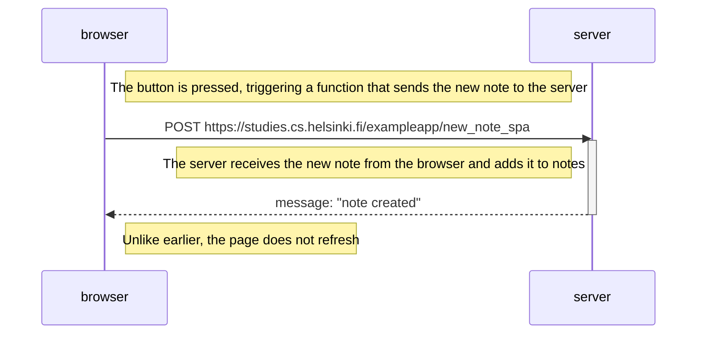

```mermaid
sequenceDiagram
    participant browser
    participant server

    Note right of browser: The button is pressed, triggering a function that sends the new note to the server

    browser->>server: POST https://studies.cs.helsinki.fi/exampleapp/new_note_spa
    activate server
    Note left of server: The server receives the new note from the browser and adds it to notes
    server-->>browser: message: "note created"
    deactivate server

    Note right of browser: Unlike earlier, the page does not refresh
```